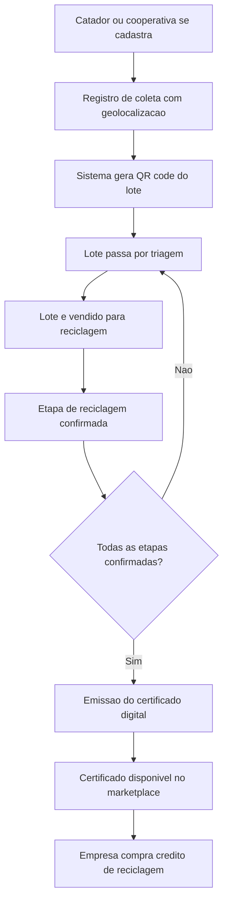
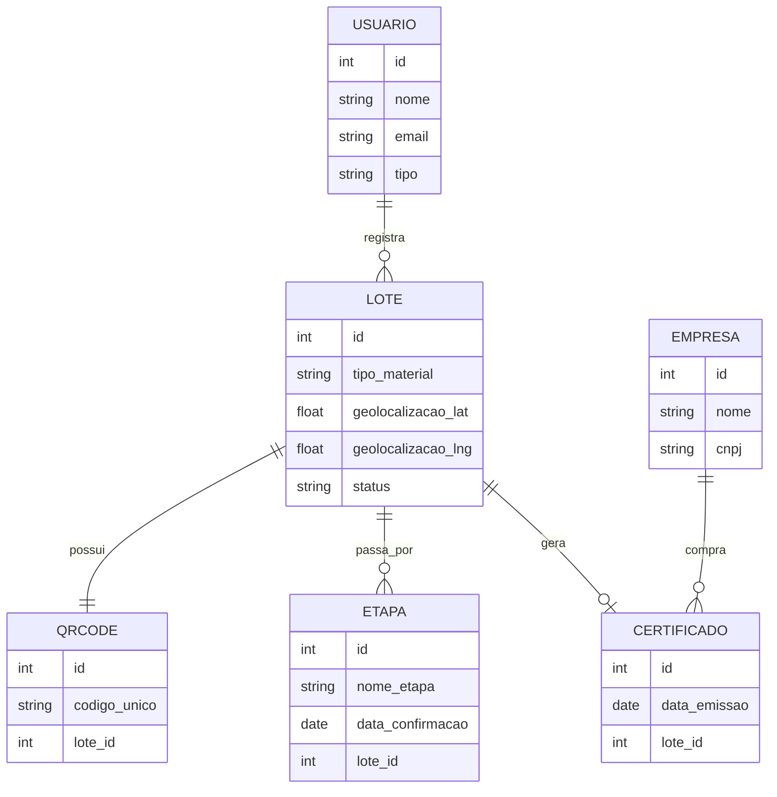

# Relatório de Arquitetura e Modelagem - EcoLastro CTBJ

## 1. Introdução

Este documento apresenta a modelagem inicial da solução EcoLastro, incluindo o fluxo de funcionamento do sistema e o modelo de dados que sustenta os requisitos definidos na Etapa 1.

## 2. Fluxograma do Processo

Fluxo principal do ciclo de vida de um lote de material reciclável, do cadastro à emissão do certificado.

## 3. Modelo de Dados (Diagrama Entidade-Relacionamento)

## 4. Protótipo de Interface (descrição textual)

Telas previstas para a primeira versão navegável (a serem prototipadas em Figma):

- Tela de login e cadastro (catador, cooperativa, empresa)
- Tela de registro de coleta (com captura de geolocalização)
- Tela de QR code gerado
- Tela de acompanhamento das etapas do lote
- Tela de marketplace de créditos (visão empresa)
- Painel de impacto ambiental (visão catador/cooperativa)

## 5. Ferramentas utilizadas na modelagem

- Mermaid.js: fluxograma e diagrama entidade-relacionamento
- Figma (previsto): protótipo de interface de alta fidelidade
